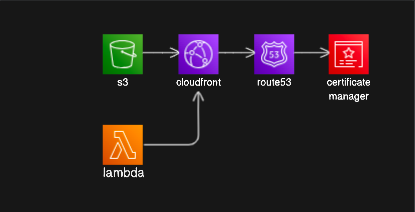

# Serverless Remix with CDK

:::tip{title="Synopsis:"}

The cdk version of this scenario (dynamic website hosting) will involve reference to a domain certificate in acm and hosted zone in Route 53 as well as a bucket. All other resource lifecycle management is handled by the cdk.

:::

[github repo](https://github.com/bronifty/rspress-blog/tree/main/blog-app-examples/cdk-dynamic-hosting)



## DNS

Domain management including TLS/SSL certificates are assumed knowledge at this point. If you need guidance please review the manual steps in the [previous page](../../scenarios/static-hosting/s3-bucket-website) which has further cdk related details in [cdk-static-hosting](../static-hosting/cdk-stack).

## CDK App

This app is actually multiple stacks with properties passed in from outputs of one class object to another's constructor (dependency injection). This was necessary due to issues related to the dependencies between the stacks and order of operations in resource construction. Breaking apart stacks and passing props makes the dependency graph explicit and maximizes developer control. We will start with the App and work backward to the details of the main stack and then back into the details of the parent stack passed into the child stack's constructor.

## App Launcher

```ts
#!/usr/bin/env node
import "source-map-support/register";
import * as cdk from "aws-cdk-lib";
import { DynamicHostingStack } from "../lib/cdk-dynamic-hosting-stack";
import { LambdaStack } from "../lib/lambda-stack";

// if your github actions workflow does not set these env vars or you don't have them preset somewhere in a file perhaps, then just hardcode them here.
process.env.CERTIFICATE_ARN =
  "arn:aws:acm:us-east-1:851725517932:certificate/f5164cd1-7532-42ba-b194-ad681a98c7f4";

// Function to get AWS account ID from environment variable
function getAccountId(): string {
  console.log(process.env.AWS_ACCOUNT_ID);
  return process.env.AWS_ACCOUNT_ID || "";
}

// Function to get AWS region from environment variable
function getRegion(): string {
  console.log(process.env.AWS_REGION);
  return process.env.AWS_REGION || "";
}

function getCertificateArn(): string {
  console.log(process.env.CERTIFICATE_ARN);
  return process.env.CERTIFICATE_ARN || "";
}

const app = new cdk.App();
const lambdaStack = new LambdaStack(app, "LambdaStack", {
  env: {
    account: getAccountId(),
    region: getRegion(),
  },
});
new DynamicHostingStack(app, "DynamicHostingStack", {
  functionUrl: lambdaStack.functionUrl,
  certificateArn: getCertificateArn(),
  env: {
    account: getAccountId(),
    region: getRegion(),
  },
});
```
