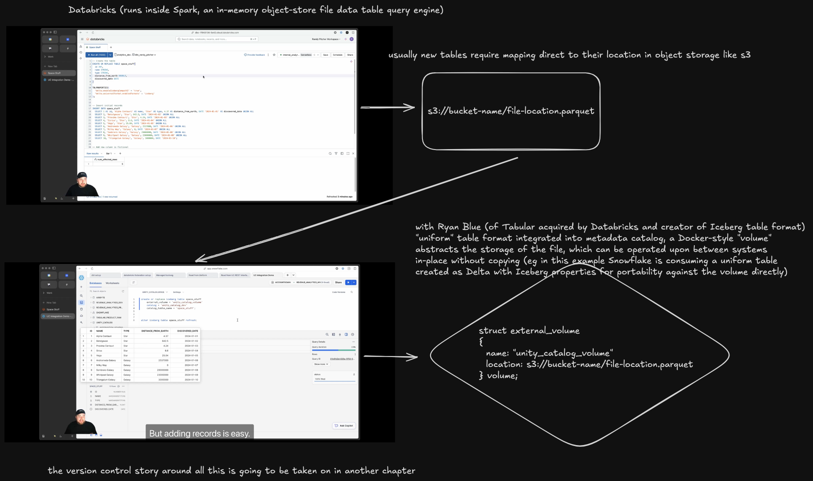

# Ryan Blue Tabular Databricks

## Uniform Table Format

Ryan Blue, creator of Iceberg table format, has created a new uniform table format for interoperability between Delta Lake, which is native to Databricks, and Iceberg as well as potentially other formats.

The figure above shows how the metadata catalog (called "unity catalog" in Databricks) can facilitate zero-copy in-place operations between table formats and query engines. In this case, Databricks on Delta is DDL'd into a shared Docker-style volume (represented as a struct mapping the file key to a named location in the catalog) and DML'd as well as DQL'd from the same volume with another, separate query engine (Snowflake).
