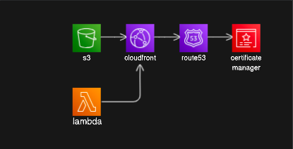

---
head:
  - - meta
    - property: og:title
      content: Dynamic Hosting with CDK
  - - meta
    - property: og:image
      content: https://bronifty.xyz/static/image/ssr-architecture.6d508a51.png
---

# Serverless Remix CDK Stack

:::tip{title="Synopsis:"}

The cdk version of this scenario (dynamic website hosting) will involve reference to a domain certificate in acm and hosted zone in Route 53. All other resource lifecycle management is handled by the cdk.

:::

[github repo](https://github.com/bronifty/blog)



## DNS

Domain management including TLS/SSL certificates are assumed knowledge at this point. If you need guidance please review the manual steps in the [scenario page](../../scenarios/static-hosting/s3-bucket-website) which has further cdk related details in [cdk-static-hosting](../static-hosting/cdk-stack).

## CDK App

This app is actually multiple stacks with properties passed in from outputs of one class object to another's constructor (dependency injection). This was necessary due to issues related to the dependencies between the stacks and order of operations in resource construction. Breaking apart stacks and passing props makes the dependency graph explicit and maximizes developer control. We will start with the App and work backward to the details of the main stack and then back into the details of the parent stack passed into the child stack's constructor.

## App Launcher

The cdk app launcher imports the stacks and constructs them in its own application scope (the parent of the cdk construct tree). A certificate arn is set as an environment variable mainly because it is a pain to handle it otherwise. Other environment variables are set in the github actions workflow.

The lambda stack passes its own function url property to the main stack with the distribution, bucket and dns. The main stack uses the property of the parent lambda stack as an argument to its constructor (dependency injection). This argument is used to set the distribution's origin to the lambda function url.

```ts
import { App } from "aws-cdk-lib";
import { BlogStack } from "./stacks/blog-stack";
import { RemixStack } from "./stacks/remix-stack";
import { ReactRouter7ContactsStack } from "./stacks/react-router-7-contacts-stack";

process.env.CERTIFICATE_ARN =
  "arn:aws:acm:us-east-1:533266994320:certificate/762bf6fe-5e4d-44bd-a67a-bc7bda41028a";
process.env.AWS_ACCOUNT_ID = "533266994320";
process.env.AWS_REGION = "us-east-1";

function getCertificateArn(): string {
  console.log(process.env.CERTIFICATE_ARN);
  return process.env.CERTIFICATE_ARN || "";
}

// Function to get AWS account ID from environment variable
function getAccountId(): string {
  console.log(process.env.AWS_ACCOUNT_ID);
  return process.env.AWS_ACCOUNT_ID || "";
}

// Function to get AWS region from environment variable
function getRegion(): string {
  console.log(process.env.AWS_REGION);
  return process.env.AWS_REGION || "";
}

const app = new App();

new BlogStack(app, "BlogStack", {
  certificateArn: getCertificateArn(),
  env: {
    account: getAccountId(),
    region: getRegion(),
  },
});

new RemixStack(app, "RemixStack", {
  certificateArn: getCertificateArn(),
  env: {
    account: getAccountId(),
    region: getRegion(),
  },
});

new ReactRouter7ContactsStack(app, "ReactRouter7ContactsStack", {
  certificateArn: getCertificateArn(),
  env: {
    account: getAccountId(),
    region: getRegion(),
  },
});
```

## Main Stack

The main stack receives the function url and cert as props which are used to configure the distribution. ssr is used as a subdomain for the apex domain and that is assigned to the distribution as an alias (cname). A bucket and lambda are both configured as origins and behaviors are set to direct all traffic to the lambda except for the specific assets route.

:::warning

Attaching the bucket policy based on the distribution's arn for an existing bucket should work, but it does not in practice. Either create a new bucket and apply the policy or apply the policy manually to an existing bucket as a workaround.

:::

```ts
import * as cdk from "aws-cdk-lib";
import { Construct } from "constructs";
import * as FsUtils from "@bronifty/fs-utils";
import { getDomainName, getSuffixFromStack } from "../utils";

interface RemixStackProps extends cdk.StackProps {
  certificateArn: string;
}

export class RemixStack extends cdk.Stack {
  constructor(scope: Construct, id: string, props: RemixStackProps) {
    super(scope, id, props);

    const ssrDomain = "ssr.bronifty.org";
    const projectRoot = `${FsUtils.getProjectRoot()}/../services/vite-remix`;

    const lambda = new cdk.aws_lambda_nodejs.NodejsFunction(
      this,
      "remix-lambda",
      {
        runtime: cdk.aws_lambda.Runtime.NODEJS_LATEST,
        handler: "handler",
        entry: `${projectRoot}/lambda.ts`,
      }
    );

    // Create a Function URL for the Lambda
    const functionUrl = lambda.addFunctionUrl({
      authType: cdk.aws_lambda.FunctionUrlAuthType.NONE,
      cors: {
        allowedOrigins: ["*"],
        allowedMethods: [cdk.aws_lambda.HttpMethod.ALL],
        allowedHeaders: ["*"],
      },
    });

    // this.functionUrl = functionUrl;

    const bucket = new cdk.aws_s3.Bucket(this, "remix-stack-assets-bucket", {
      bucketName: `remix-stack-assets-bucket-${getSuffixFromStack(this)}`,
      publicReadAccess: false,
      blockPublicAccess: cdk.aws_s3.BlockPublicAccess.BLOCK_ALL,
      removalPolicy: cdk.RemovalPolicy.DESTROY,
      autoDeleteObjects: true,
    });

    // Create Origin Access Control
    const oac = new cdk.aws_cloudfront.CfnOriginAccessControl(this, "OAC", {
      originAccessControlConfig: {
        name: "oac-s3-2-remix-stack",
        originAccessControlOriginType: "s3",
        signingBehavior: "always",
        signingProtocol: "sigv4",
      },
    });

    // Create CloudFront distribution using CfnDistribution
    const distribution = new cdk.aws_cloudfront.CfnDistribution(
      this,
      "Distribution",
      {
        distributionConfig: {
          enabled: true,
          // defaultRootObject: "index.html",
          defaultCacheBehavior: {
            targetOriginId: "LambdaOrigin",
            viewerProtocolPolicy: "redirect-to-https",
            allowedMethods: [
              "GET",
              "HEAD",
              "OPTIONS",
              "PUT",
              "PATCH",
              "POST",
              "DELETE",
            ], // Allow all methods
            cachedMethods: ["GET", "HEAD"],
            forwardedValues: {
              queryString: true, // Forward query strings to Lambda
              headers: [
                "Origin",
                "Access-Control-Request-Headers",
                "Access-Control-Request-Method",
              ], // Forward necessary headers
            },
          },
          origins: [
            {
              id: "S3Origin",
              domainName: bucket.bucketRegionalDomainName,
              originAccessControlId: oac.getAtt("Id").toString(),
              s3OriginConfig: {},
            },
            {
              id: "LambdaOrigin",
              domainName: getDomainName(functionUrl.url),
              customOriginConfig: {
                httpPort: 80,
                httpsPort: 443,
                originProtocolPolicy: "https-only",
              },
            },
          ],
          cacheBehaviors: [
            {
              pathPattern: "/assets/*",
              targetOriginId: "S3Origin",
              viewerProtocolPolicy: "redirect-to-https",
              allowedMethods: ["GET", "HEAD", "OPTIONS"],
              cachedMethods: ["GET", "HEAD"],
              forwardedValues: {
                queryString: false,
              },
            },
          ],
          viewerCertificate: {
            acmCertificateArn: props.certificateArn,
            sslSupportMethod: "sni-only",
            minimumProtocolVersion: "TLSv1.2_2021",
          },
          aliases: [ssrDomain],
          priceClass: cdk.aws_cloudfront.PriceClass.PRICE_CLASS_100,
          customErrorResponses: [
            {
              errorCode: 403,
              responsePagePath: "/index.html",
              responseCode: 200,
              errorCachingMinTtl: 300,
            },
            {
              errorCode: 404,
              responsePagePath: "/index.html",
              responseCode: 200,
              errorCachingMinTtl: 300,
            },
          ],
        },
      }
    );

    // Deploy website content
    new cdk.aws_s3_deployment.BucketDeployment(this, "DeployWebsite", {
      sources: [
        cdk.aws_s3_deployment.Source.asset(`${projectRoot}/build/client`),
      ],
      destinationBucket: bucket,
      distribution: cdk.aws_cloudfront.Distribution.fromDistributionAttributes(
        this,
        "ImportedDistribution",
        {
          domainName: distribution.attrDomainName,
          distributionId: distribution.ref,
        }
      ),
      distributionPaths: ["/*"],
    });

    // Update bucket policy
    bucket.addToResourcePolicy(
      new cdk.aws_iam.PolicyStatement({
        actions: ["s3:GetObject"],
        resources: [bucket.arnForObjects("*")],
        principals: [
          new cdk.aws_iam.ServicePrincipal("cloudfront.amazonaws.com"),
        ],
        conditions: {
          StringEquals: {
            "AWS:SourceArn": `arn:aws:cloudfront::${this.account}:distribution/${distribution.ref}`,
          },
        },
      })
    );
    // Export the Function URL as a stack output
    new cdk.CfnOutput(this, "remix-lambda-url", {
      value: functionUrl.url,
    });
    new cdk.CfnOutput(this, "DistributionUrl", {
      value: `https://${distribution.attrDomainName}`,
    });
    new cdk.CfnOutput(this, "BucketUrl", {
      value: `https://${bucket.bucketRegionalDomainName}`,
    });
  }
}
```

## Lambda Function

```ts
import { createRequestHandler } from "@remix-run/express";
import serverless from "serverless-http";
import express from "express";
import * as build from "./build/server/index.js";

const app = express();

// Serve static files from the client build directory
// app.use(express.static("build/client"));

// Handle all routes with the Remix request handler
app.all("*", createRequestHandler({ build }));

// // Create a serverless handler
const handler = serverless(app);

export { app, handler };
```
