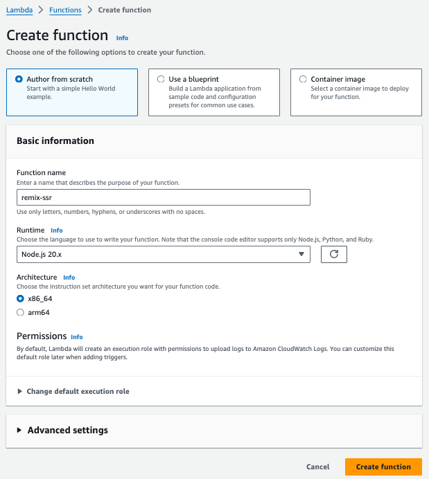
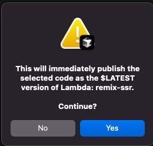
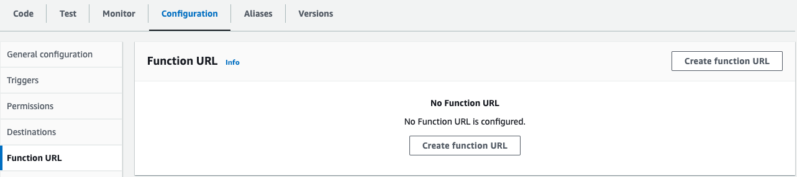
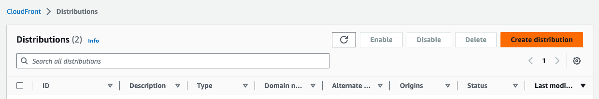
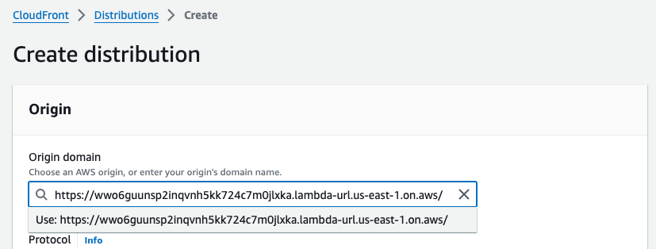
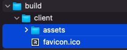
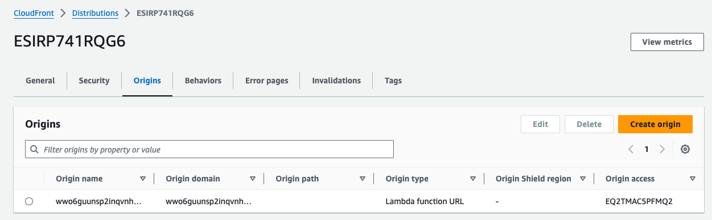
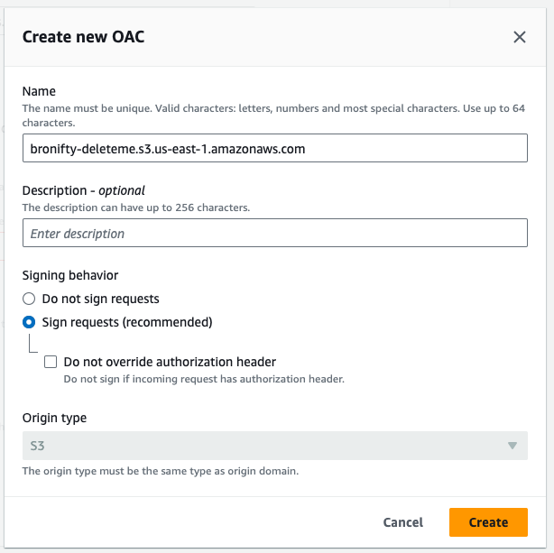
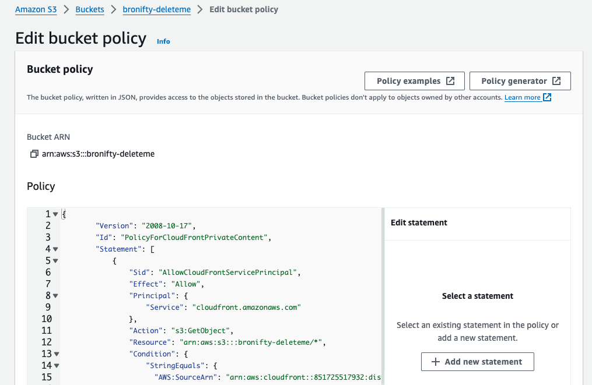
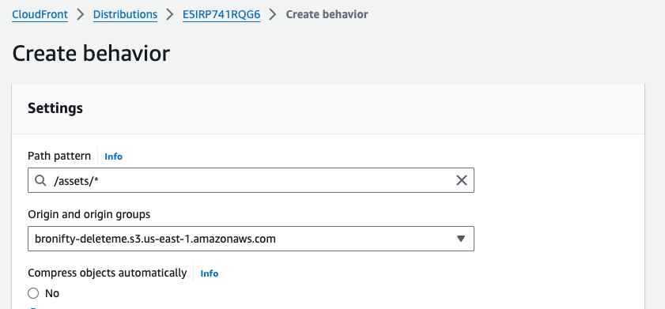

# Serverless Remix

:::tip{title="Synopsis:"}
We are going to deploy a serverless remix app on lambda with a bucket for the assets and cloudfront cdn cache protection and routing. Details of server function and build process are below. This will be the aws manual deployment steps.
:::

[github repo](https://github.com/bronifty/rspress-blog/tree/main/blog-app-examples/remix-lambda)

## Create Blank Lambda Function

Chose all the defaults and click create. Next we are going to make a config update to make sure the handler name is reachable by the service.




## Upload Function

Once that function is created in the console, we will have access to it in the aws explorer for vs code where we can upload to it directly from the repo (it could also be dragged and dropped in the console).




## Invoke Function

Once that's uploaded let's invoke it with a lambda-related event type such as api gateway proxy or cloudfront request.


:::danger{title="t-shoot"}
If you get an error you will need to troubleshoot it. Make sure you named the function in aws the same as it is named in the zip archive. Details about building and zipping the code are on the next page. It can also be inferred via package.json linked above.
:::

## Create Function URL

Create a function url in order to integrate this with any service via direct api request without a gateway.




## Visit App

Visit the remix app in the browser to confirm it works and make sure to click it and make sure it is interactive.


## Cloudfront Distribution

Create a Cloudfront Distribution with the function as origin. We will leave the security open for now and take up auth in a subsequent lesson.

:::warning
aside from the function url origin leave all the defaults and click create distribution. Note: current settings will ask you to choose WAF or not; you can select no.
:::





:::danger{title="t-shoot"}
make sure to test the distribution to make sure it can access the default route to your function url.
:::

## Assets bucket

Create an assets bucket with all defaults and drop your frontend build assets into it.

:::info
you want just the client assets folder (and the favicon) not the parent build folder, based on the way it is currently set up.
:::

:::warning
steps to build the remix app and get the static assets folder is on the next page in function details.
:::





## Distribution Assets Origin

Create a new origin for the distribution with the assets bucket and set the behavior for the assets path to that bucket. The distribution will use an origin access control (OAC) to allow the assets bucket to be accessed. This will involve copying the oac policy to the bucket.

1. Create the origin




2. Create the OAC




3. Copy the OAC policy to the bucket




## Distribution Assets behavior

Create a behavior (route) for the assets path to the assets bucket origin. Use defaults other than the route and the origin.




:::danger{title="t-shoot"}
make sure to test the distribution to make sure it can access the assets route to your assets bucket.
:::

:::warning{title="Details"}
[function and code build details next page](/scenarios/dynamic-hosting/function-details)
:::

## Function Details

[github repo](https://github.com/bronifty/rspress-blog/tree/main/blog-app-examples/remix-lambda)

## Remix Server Function

We are going to create the most basic app with only 2 routes and a shared counter (code not state) to demonstrate deploying an ssr app with lambda and a bucket, routed by cloudfront.

:::tip
In an ssr app, there are 3 routers:

1. api GET and POST for initial load and actions/mutations on the route (ssr html with api data)
2. static assets for interactivity (server middleware or a bucket)
3. client browser history (push and pop state for that spa effect)

:::

```sh
npx create-remix@latest
```

## Lambda Function

The lambda function is a custom server entrypoint for the remix app which serves as a request handler for the server file in the build folder, which is imported as a module. This is the api router (#1 listed above in tip). If you'll notice, we have the middleware for static assets turned off / ghosted / commented out. We will instead use a bucket to host static assets (#2 listed above in tip). The 3rd router (client browser history) is handled by the react router functionality of remix itself.

Notably, we are importing the api server file, and creating a router from express which is passed to a package to format the event handling for lambda called serverless-http.

```js
// lambda.js
import { createRequestHandler } from "@remix-run/express";
import serverless from "serverless-http";
import express from "express";
import * as build from "./build/server/index.js";

const app = express();

// Serve static files from the client build directory
// app.use(express.static("build/client"));

// Handle all routes with the Remix request handler
app.all("*", createRequestHandler({ build }));

// // Create a serverless handler
const handler = serverless(app);

export { handler };
```

## Build Lambda Function

In order to deploy this, it will need to be built to a javascript node format that is compatible with lambda. We will use esbuild. Here is it's configuration.

```js
// esbuild.mjs
import * as esbuild from "esbuild";

await esbuild.build({
  entryPoints: ["lambda.js"],
  bundle: true,
  platform: "node",
  target: "node20",
  format: "cjs", // Change format to CommonJS
  outfile: "lambda.cjs", // Change output file extension to .cjs
  external: ["node:fs", "node:path", "node:crypto"],
});

console.log("Build complete");
```

## Package.json

By way of background, here are the package.json scripts I'm using for convenience to run the commands. Build runs the esbuild file. Test will create an entrypoint that passes an event to the serverless handler function. Zip puts the server files in an archive in a format that is compatible with lambda.

```json
"clean": "rm -rf build lambda.cjs lambda.zip",
"build": "pnpm clean && remix vite:build && node esbuild.mjs",
"test": "pnpm build && node ./test/local.js",
"zip": "zip -r lambda.zip lambda.cjs build"
```

## Local Test Harness (Validate App Router and Handler)

This uses a local event file for api gateway and cloudfront, which can be found in the accompanying repo mentioned up top.

```js
//local.js
import { handler } from "../lambda.js";
import fs from "fs/promises";
import path from "path";

async function readJsonFile(filename) {
  const filePath = path.join(process.cwd(), "events", filename);
  const data = await fs.readFile(filePath, "utf8");
  return JSON.parse(data);
}

const apigRequest = await readJsonFile("apig.json");
const cloudfrontRequest = await readJsonFile("cloudfront.json");

async function main(event) {
  const result = await handler(event);
  console.log(result.body);
}

main(apigRequest);
main(cloudfrontRequest);
```

## Build

Lastly, the remix app will need to be built on the client and server. The esbuild handles the server, which outputs to lambda. Vite, as is currently managing remix, will run and bundle the client files (as well as the server file that the lambda imports).
