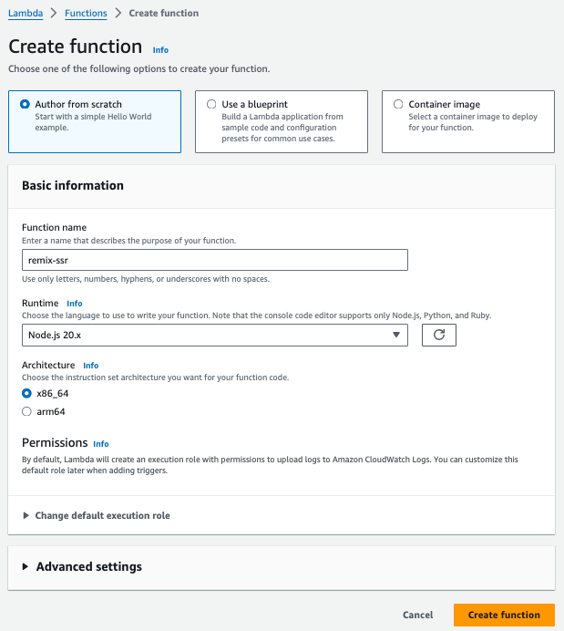

# Serverless Remix

:::tip{title="Synopsis:"}
We are going to deploy a serverless remix app on lambda with a bucket for the assets and cloudfront cdn cache protection and routing. Details of server function and build process are on the next page. This will be the aws manual deployment steps.
:::

## Create Blank Lambda Function

Chose all the defaults and click create. Next we are going to make a config update to make sure the handler name is reachable by the service.

:::warning{title="Details"}
[details of server function and build process](/scenarios/dynamic-hosting/function-details)
:::
