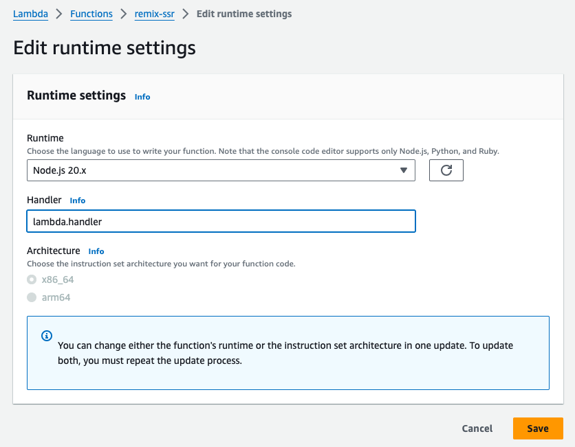
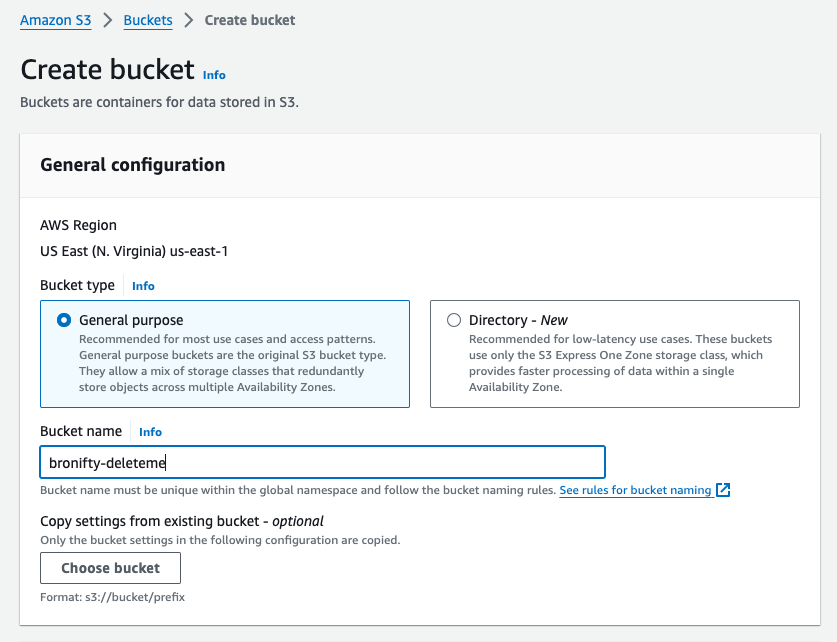
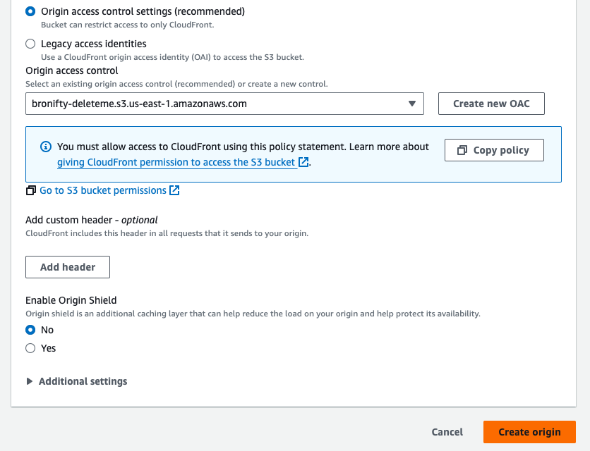
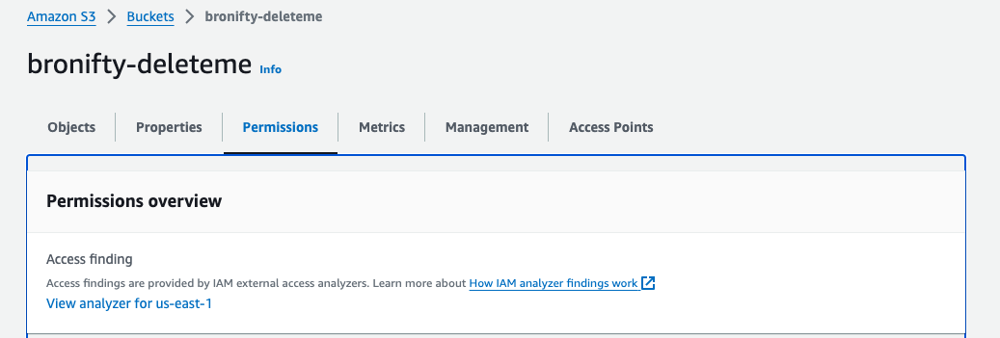
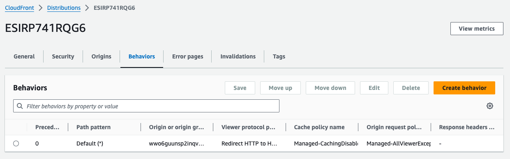

# Serverless Remix

:::tip{title="Synopsis:"}
We are going to deploy a serverless remix app on lambda with a bucket for the assets and cloudfront cdn cache protection and routing. Details of server function and build process are on the next page. This will be the aws manual deployment steps.
:::

[github repo](https://github.com/bronifty/rspress-blog/tree/main/blog-app-examples/remix-lambda)

## Create Blank Lambda Function

Chose all the defaults and click create. Next we are going to make a config update to make sure the handler name is reachable by the service.

## Upload Function

Once that function is created in the console, we will have access to it in the aws explorer for vs code where we can upload to it directly from the repo (it could also be dragged and dropped in the console).

## Invoke Function

Once that's uploaded let's invoke it with a lambda-related event type such as api gateway proxy or cloudfront request.

:::danger{title="t-shoot"}
If you get an error you will need to troubleshoot it. Make sure you named the function in aws the same as it is named in the zip archive. Details about building and zipping the code are on the next page. It can also be inferred via package.json linked above.
:::

## Create Function URL

Create a function url in order to integrate this with any service via direct api request without a gateway.

## Visit App

Visit the remix app in the browser to confirm it works and make sure to click it and make sure it is interactive.

## Cloudfront Distribution

Create a Cloudfront Distribution with the function as origin. We will leave the security open for now and take up auth in a subsequent lesson.

:::warning
aside from the function url origin leave all the defaults and click create distribution. Note: current settings will ask you to choose WAF or not; you can select no.
:::

## Assets bucket

Create an assets bucket with all defaults and drop your frontend build assets into it.

:::info
you want just the client assets folder (and the favicon) not the parent build folder, based on the way it is currently set up.
:::

:::warning
steps to build the remix app and get the static assets folder is on the next page in function details.
:::

## Distribution Origin

Create a new origin for the distribution with the assets bucket and set the behavior for the assets path to that bucket. The distribution will use an origin access control (OAC) to allow the assets bucket to be accessed. This will involve copying the oac policy to the bucket.

:::warning{title="Details"}
[function and code build details next page](/scenarios/dynamic-hosting/function-details)
:::
