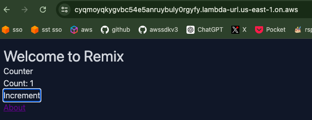

# Serverless Remix

:::tip{title="Synopsis:"}
We are going to deploy a serverless remix app on lambda with a bucket for the assets and cloudfront cdn cache protection and routing. Details of server function and build process are on the next page. This will be the aws manual deployment steps.
:::

[github repo](https://github.com/bronifty/rspress-blog/tree/main/blog-app-examples/remix-lambda)

## Create Blank Lambda Function

Chose all the defaults and click create. Next we are going to make a config update to make sure the handler name is reachable by the service.

## Upload Function

Once that function is created in the console, we will have access to it in the aws explorer for vs code where we can upload to it directly from the repo (it could also be dragged and dropped in the console).

## Invoke Function

Once that's uploaded let's invoke it with a lambda-related event type such as api gateway proxy or cloudfront request.

:::danger{title="Warning"}
If you get an error you will need to troubleshoot it. Make sure you named the function in aws the same as it is named in the zip archive. Details about building and zipping the code are on the next page. It can also be inferred via package.json linked above.
:::

:::warning{title="Details"}
[details of server function and build process](/scenarios/dynamic-hosting/function-details)
:::
