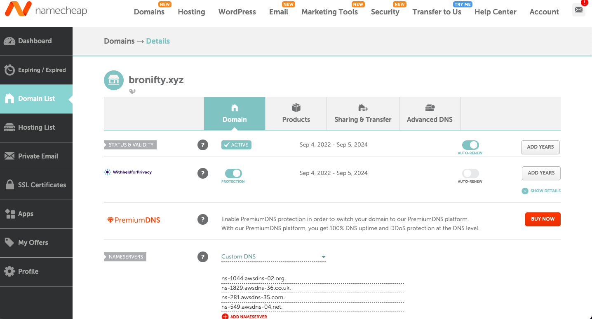

# S3 Bucket Website CDK Stack

:::tip{title="Synopsis:"}

The cdk version of this scenario (static website hosting) will involve manual creation of a hosted zone in Route 53 as well as a bucket, both if which will be referenced in the stack. All other resource lifecycle management is handled by the cdk.

:::

This is what our system architecture will look like:


## Route 53

Create a hosted zone for your apex domain and point your domain registrar's nameservers to Route 53.




## CDK Stack

The rest is a CDK stack which I will explain in some detail. It may help to just make a video explaining more however to save time. The major items are what has already been mentioned above - namely, that the dns and bucket are referenced rather than created in the stack. Notably, the distribution uses a lower level construct in order to get more control over the settings, specifically becaue it uses the new tech OAC rather than OAI, which comes standard with the higher level distribution construct. A couple of A records are created to point the domain to the distribution's ip address. And the bucket policy is updated to allow the distribution to access the bucket. Finally, the website content is deployed to the bucket from a local directory, which is this blog's build directory. In the CI/CD pipeline (github actions), the blog is built and its output is used subsequently in the bucket deployment of the cdk stack. This way, the content is always up to date and the process is fully automated.

```ts
import * as cdk from "aws-cdk-lib";
import { Construct } from "constructs";
import { getProjectRoot } from "@bronifty/fs-utils";
import * as s3 from "aws-cdk-lib/aws-s3";
import * as cloudfront from "aws-cdk-lib/aws-cloudfront";
import * as s3deploy from "aws-cdk-lib/aws-s3-deployment";
import * as iam from "aws-cdk-lib/aws-iam";

console.log(`${getProjectRoot()}/../../doc_build`);

export class CdkStaticHostingStack extends cdk.Stack {
  constructor(scope: Construct, id: string, props?: cdk.StackProps) {
    super(scope, id, props);

    const domainName = "bronifty.xyz";
    const www = `www.${domainName}`;
    const bucket = s3.Bucket.fromBucketArn(
      this,
      "ExistingBucket",
      "arn:aws:s3:::bronifty.xyz"
    );

    // Look up the hosted zone
    const zone = cdk.aws_route53.HostedZone.fromLookup(this, "Zone", {
      domainName,
    });

    // Create a certificate
    const certificate = new cdk.aws_certificatemanager.Certificate(
      this,
      "Certificate",
      {
        domainName: domainName,
        subjectAlternativeNames: [www],
        validation:
          cdk.aws_certificatemanager.CertificateValidation.fromDns(zone),
      }
    );

    // Create Origin Access Control
    const oac = new cloudfront.CfnOriginAccessControl(this, "OAC", {
      originAccessControlConfig: {
        name: "OAC for S3 Static Website",
        originAccessControlOriginType: "s3",
        signingBehavior: "always",
        signingProtocol: "sigv4",
      },
    });

    // Create CloudFront distribution using CfnDistribution
    const distribution = new cloudfront.CfnDistribution(this, "Distribution", {
      distributionConfig: {
        enabled: true,
        defaultRootObject: "index.html",
        defaultCacheBehavior: {
          targetOriginId: "S3Origin",
          viewerProtocolPolicy: "redirect-to-https",
          allowedMethods: ["GET", "HEAD", "OPTIONS"],
          cachedMethods: ["GET", "HEAD"],
          forwardedValues: {
            queryString: false,
          },
        },
        origins: [
          {
            id: "S3Origin",
            domainName: bucket.bucketRegionalDomainName,
            originAccessControlId: oac.getAtt("Id").toString(),
            s3OriginConfig: {},
          },
        ],
        viewerCertificate: {
          acmCertificateArn: certificate.certificateArn,
          sslSupportMethod: "sni-only",
          minimumProtocolVersion: "TLSv1.2_2021",
        },
        aliases: [domainName, www],
        customErrorResponses: [
          {
            errorCode: 403,
            responsePagePath: "/index.html",
            responseCode: 200,
            errorCachingMinTtl: 300,
          },
          {
            errorCode: 404,
            responsePagePath: "/index.html",
            responseCode: 200,
            errorCachingMinTtl: 300,
          },
        ],
      },
    });

    // Create an IDistribution interface from the CfnDistribution
    const distributionInterface =
      cloudfront.Distribution.fromDistributionAttributes(
        this,
        "ImportedDistributionInterface",
        {
          domainName: distribution.attrDomainName,
          distributionId: distribution.ref,
        }
      );

    // Create Route 53 records
    new cdk.aws_route53.ARecord(this, "AliasRecord", {
      zone,
      recordName: domainName,
      target: cdk.aws_route53.RecordTarget.fromAlias(
        new cdk.aws_route53_targets.CloudFrontTarget(distributionInterface)
      ),
    });

    new cdk.aws_route53.ARecord(this, "WWWAliasRecord", {
      zone,
      recordName: www,
      target: cdk.aws_route53.RecordTarget.fromAlias(
        new cdk.aws_route53_targets.CloudFrontTarget(distributionInterface)
      ),
    });

    // Update bucket policy
    bucket.addToResourcePolicy(
      new iam.PolicyStatement({
        actions: ["s3:GetObject"],
        resources: [bucket.arnForObjects("*")],
        principals: [new iam.ServicePrincipal("cloudfront.amazonaws.com")],
        conditions: {
          StringEquals: {
            "AWS:SourceArn": `arn:aws:cloudfront::${this.account}:distribution/${distribution.ref}`,
          },
        },
      })
    );

    // Deploy website content
    new s3deploy.BucketDeployment(this, "DeployWebsite", {
      sources: [s3deploy.Source.asset(`${getProjectRoot()}/../../doc_build`)],
      destinationBucket: bucket,
      distribution: cloudfront.Distribution.fromDistributionAttributes(
        this,
        "ImportedDistribution",
        {
          domainName: distribution.attrDomainName,
          distributionId: distribution.ref,
        }
      ),
      distributionPaths: ["/*"],
    });

    new cdk.CfnOutput(this, "CustomDomainUrl", {
      value: `https://${domainName}`,
      description: "Custom Domain URL",
    });
    new cdk.CfnOutput(this, "WWWCustomDomainUrl", {
      value: `https://${www}`,
      description: "WWW Custom Domain URL",
    });
    new cdk.CfnOutput(this, "DistributionUrl", {
      value: `https://${distribution.attrDomainName}`,
      description: "CloudFront Distribution URL",
    });
    new cdk.CfnOutput(this, "BucketUrl", {
      value: `https://${bucket.bucketRegionalDomainName}`,
      description: "S3 Bucket URL",
    });
  }
}
```
